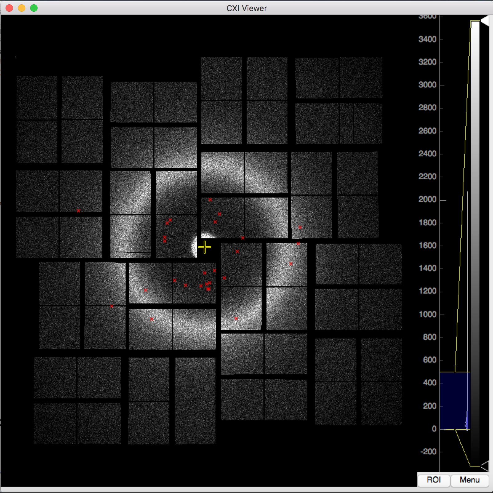
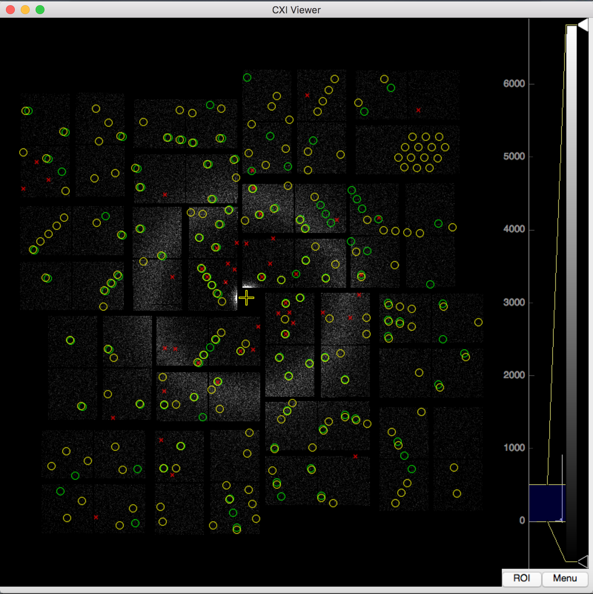
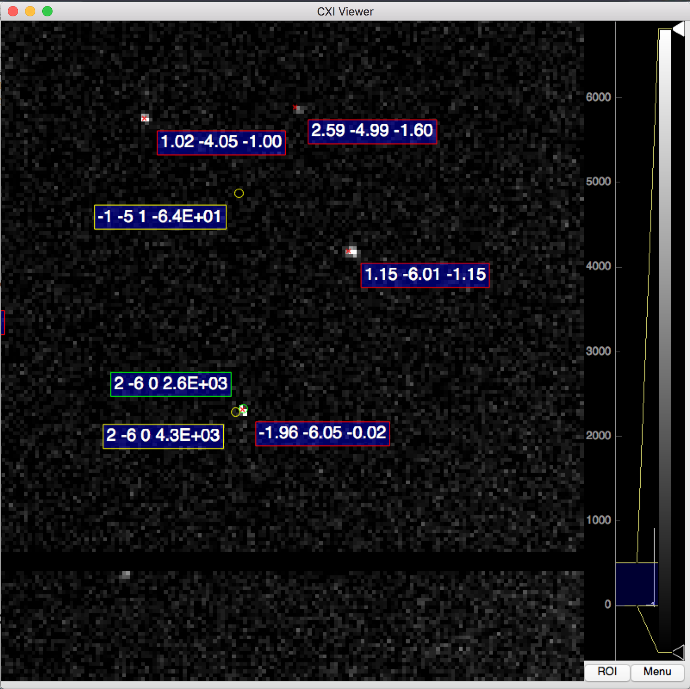

# CXI Viewer
---
**CXI Viewer** is a light visualization tool to show diffraction or scattering patterns collected at LCLS@USA in cxi format. You can also check the peak finding results from [Cheetah](http://www.desy.de/~barty/cheetah/Cheetah/Welcome.html) and indexing results from [CrystFEL](http://www.desy.de/~twhite/crystfel/).

## System Requirement
* Python 2.7
* scipy
* numpy
* h5py
* [pyqtgraph](http://www.pyqtgraph.org)
* [docopt](http://docopt.org)

## Usage
```
Usage:
    cxi_viewer.py -f cxi_file -g geometry_file [options]

Options:
    -h --help                                       Show this screen.
    -f data.cxi                                     Specify cxi file for visulization.
    -g geometry_file                                Geometry file in cheetah, crystfel or psana format.
    --start=start_from                              First frame to render [default: 0].
    --stream1=first.stream                          First stream file.
    --stream2=second.stream                         Second stream file.
    --spind-abcstar=spind.txt                       Indexing results of SPIND containing abcstar.
    --show-hkl=show_hkl                             Whether show HKL indice [default: True].
    --cmin=cmin                                     Color level lower limit [default: 0].
    --cmax=cmax                                     Color level upper limit [default: 500].
```

## Shortcut Keys
* Left arrow: next frame
* Right arrow: last frame
* N: next indexed frame
* L: last indexed frame
* Space: display information of mouse location
* 1: enable/disable reflection display from first stream file
* 2: enable/disable reflection display from second stream file
* H: enalbe/disable HKL and intensity display


## Screenshots
Display pattern and peaks found by Cheetah.

Display predicted reflections from the given stream files.

Display reflection Miller indices, intensity and decimal Miller indices calculated from SPIND indexing results.

