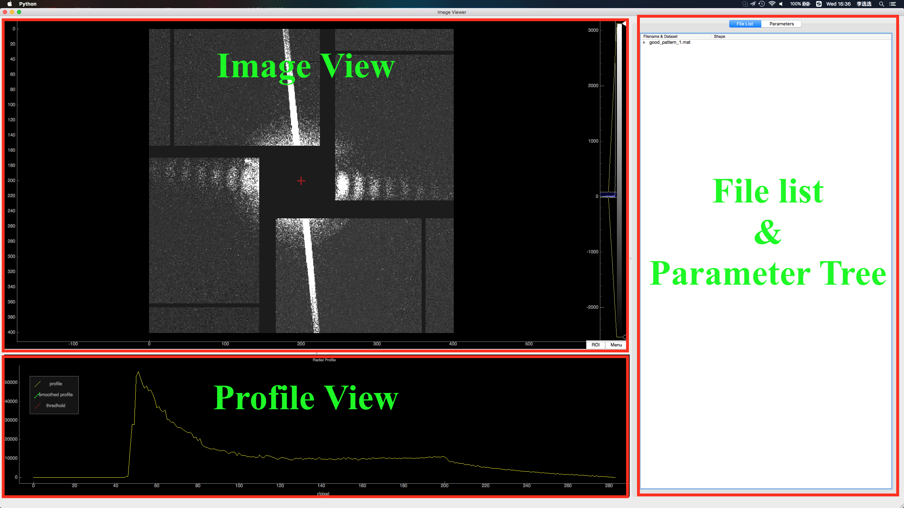
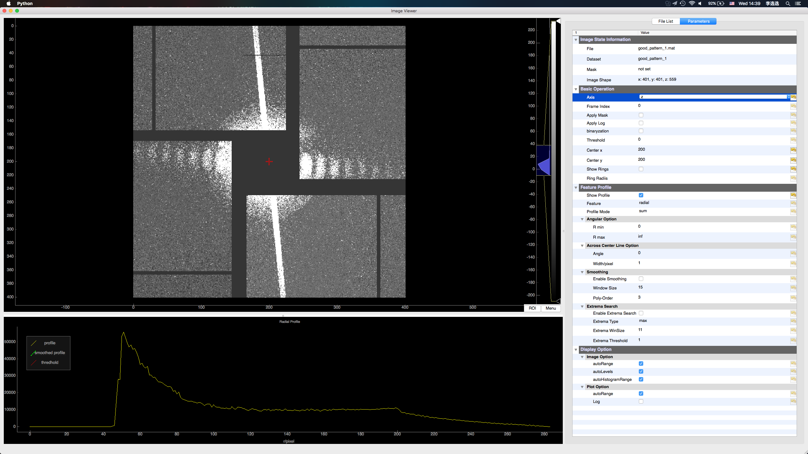

## Image Viewer & Analyzer

### Introduction
This tool can display 2d or 3d data from **mat, h5, npy or npz** format files. Using `pyqtgraph` based on `qt` engine, you can easily manipulate the colorbar and zoom in or out the image. Some basic operation has also been intergrated. Feel free to use this tool if you are working with images.

### Installation
This tool has some dependencies: pyqt4, pyqtgraph, numpy, scipy, docopt. You can install these libraries easily using `pip`.

### Usage

#### Add data file(s)
Just drag your data file(s) into image viewer window, it(they) will be added to the file list. Double click the file item or dataset item to see the corresponding dataset.

#### Show feature profile
In parameter tree widget, enable the `Show Profile` to show radial, angular or across central line profile.

#### Other features
There are some other features you may be interested in: mask, binaryzation, center, show ring. All the operation is self-explanatory(I think so). Have problems? Just have a try!